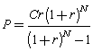
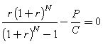
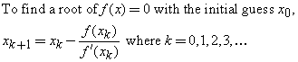
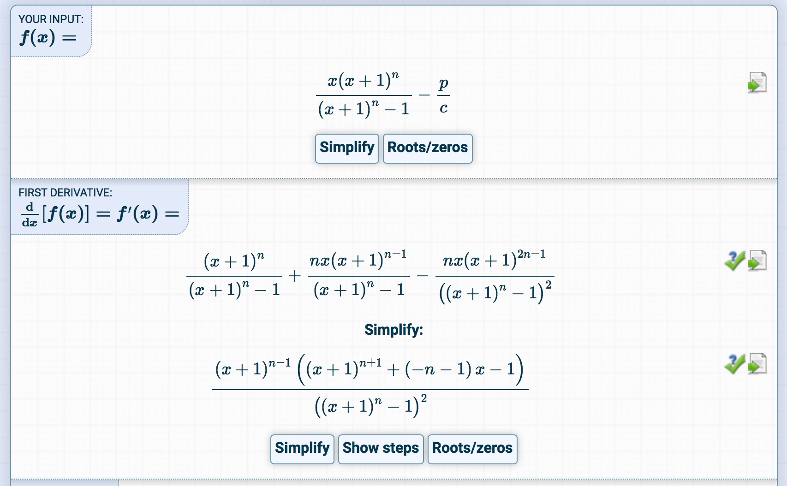

# Zopa Loan Matcher

[](https://travis-ci.org/kavai77/loanmatcher)

## Prerequisites
* JDK 8
* Maven
* Git

## Running
```
> git clone https://github.com/kavai77/loanmatcher.git
> mvn package
> ./quote.sh marketdata.csv 1000
```


## Assumptions
For monthly payment and final interest rate calculation I used the formulas from
http://www.efunda.com/formulae/finance/loan_calculator.cfm

## Selecting the best lenders
The best lenders are the ones with the lowest interest rate. The selection of best lenders is a greedy algorithm.

Binary heap is the best data structure for choosing the m smallest elements from an unsorted list of size n.

The time complexity for building a heap by inserting elements one-by-one O(n*log(n)).
(There is a more efficient algorithm from Floyd to build a binary heap in O(n) time, but it was not available in Java)

The selection and removal of the head from the heap is O(log n)  

The Java implementation of binary heap is java.util.PriorityQueue

## Monthly payment calculation
The formula for calculating the monthly payment for one lender is this:



where:
```
C - Loan Amount (C)
r - Interest Rate / 12 
N - Number of Months
P - Monthly Payment
```

I calculated the final monthly payment by summing up the individual monthly payments from multiple lenders.


## Interest rate calculation
After calculating the final monthly repayment, we have to calculate the final interest rate.
The formula which should be solved is this:



Here we have to find a good enough `r` so that this formula is close enough to zero.

This can be solved by numerical means, using the **Newton-Raphson** method:



Here the challenge was to calculate the first derivative of the function above.
I used an online tool for that. This is the first derivative:



I had to substitute the `r` by `x` for this tool.

Finally I just had to implement the iteration. From my experience I found a pretty close interest rate after 3 or 4 iterations. 
So this is much faster than naive guessing.

Please note that this implementation is entirely mine, I did my own research about the formulas and the methods. 
I did not use any 3rd party tool for Newton-Raphson, nor did I use or copy any 3rd parties for any of the calculations above. 

## Implementation
I used Java 8 for implementing these algorithm.

I used a library called opencsv for parsing and loading csv files

I also used guice for wiring up the objects.

